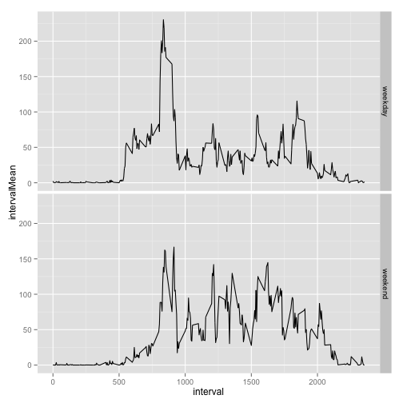

Léo Souquet - Reproducible Research - Peer Assessment 1
========================================================

## Loading and preprocessing the data

The data set contains 3 columns are :

1. "steps", numeric, represents the number of steps for the 5 minutes interval
2. "date", Date format, represents the date where the steps have been made for the interval
3. "interval", numeric, represents the interval within the date where the steps have been recorded


```r
data <- read.csv("activity.csv", stringsAsFactors = F, colClasses = c("numeric","Date","numeric"))

head(data)
```

```
##   steps       date interval
## 1    NA 2012-10-01        0
## 2    NA 2012-10-01        5
## 3    NA 2012-10-01       10
## 4    NA 2012-10-01       15
## 5    NA 2012-10-01       20
## 6    NA 2012-10-01       25
```


## What is mean total number of steps taken per day?

First we ignore the missing value, which means we take them off from the data set.

The reason why is that if we were to calculate the mean with missing values, the result would be "NA", therefore we decided to create a new data set "complete" which does not contains missing values. 


```r
complete <- data[complete.cases(data),]
head(complete)
```

```
##     steps       date interval
## 289     0 2012-10-02        0
## 290     0 2012-10-02        5
## 291     0 2012-10-02       10
## 292     0 2012-10-02       15
## 293     0 2012-10-02       20
## 294     0 2012-10-02       25
```

Then we create an histogram that reflects the total number of steps taken each day

```r
hist(tapply(complete$steps,complete$date,sum), breaks = length(unique(complete$date)), main="", xlab = "Total number of steps taken each day")
```

 

We have chosen the numbers of breaks equal to the number of days in the data set.

### We now calculate the mean and median of the total number of steps taken per day.


```r
mean <- mean(tapply(complete$steps,complete$date,sum))

median <- median(tapply(complete$steps,complete$date,sum))
```

The mean of the total number of steps taken per day is 1.0766 &times; 10<sup>4</sup>

The median of the total number of steps taken per day is 1.0765 &times; 10<sup>4</sup>

## What is the average daily activity pattern?

We create an series plot of the 5-minute interval (x-axis) and the average number of steps taken, averaged across all days (y-axis)


```r
plot(unique(data$interval),tapply(complete$steps,complete$interval,mean), type = "l", xlab = "5-minute interval", ylab ="Average number of steps taken")
```

 

We then determine the 5-minute interval which contains the maximum number of steps

```r
#Get the means of each interval
intervalsMeans <- tapply(complete$steps,complete$interval,mean)

#Determine the maximum value
max <- max(tapply(complete$steps,complete$interval,mean))

#Get the name of the 5-minute interval with the maximum value
names(which(intervalsMeans == max))
```

```
## [1] "835"
```

The 5-minute interval number 835 contains, on average across all the days in the dataset, the maximum number of steps.


## Imputing missing values

### In this part we aim to imput missing values.

Firstly we seek the number of rows with missing values in the data set.


```r
#Number of rows with NA
NAs <- data[!complete.cases(data),]
```

There is 2304 rows with missing values in the data set.

#### Filling in missing values strategy
The strategy we have chosen for filling in all missing values is to use the mean for the corresponding 5-minute interval.

We will use the vector we used above to calculate number of the 5-minute interval with the maximum number of steps

```r
head(intervalsMeans)
```

```
##       0       5      10      15      20      25 
## 1.71698 0.33962 0.13208 0.15094 0.07547 2.09434
```

Wee then copy the original data set.

```r
dataFilledInMissing <- data
```

Then, for each interval, we fill in the missing values with the mean of the correponding interval.


```r
for(i in unique(dataFilledInMissing$interval))
{
      dataFilledInMissing$steps[is.na(dataFilledInMissing$steps) & dataFilledInMissing$interval == i] <- intervalsMeans[as.character(i)]
}

#New data set with filled in values

head(dataFilledInMissing)
```

```
##     steps       date interval
## 1 1.71698 2012-10-01        0
## 2 0.33962 2012-10-01        5
## 3 0.13208 2012-10-01       10
## 4 0.15094 2012-10-01       15
## 5 0.07547 2012-10-01       20
## 6 2.09434 2012-10-01       25
```

We verify that there are no more missing values.

Number of missing values in the new data set "dataFilledInMissing" : 0

### Histogram of the total number of steps taken each day with imputed missing values

```r
hist(tapply(dataFilledInMissing$steps,dataFilledInMissing$date,sum), breaks = length(unique(dataFilledInMissing$date)), main="", xlab = "Total number of steps taken each day")
```

 

### We now calculate the mean and median of the total number of steps taken per day with imputed missing values


```r
mean <- mean(tapply(dataFilledInMissing$steps,dataFilledInMissing$date,sum))

median <- median(tapply(dataFilledInMissing$steps,dataFilledInMissing$date,sum))
```

The mean of the total number of steps taken per day is 1.0766 &times; 10<sup>4</sup>

The median of the total number of steps taken per day is 1.0766 &times; 10<sup>4</sup>

The difference between the values with or without the imputed values is neglecible, therefore we can state that the mean and median are identical to the etimates made in the first par of the assignment.

By imputting missing values, we attempt to get as close as the possible to reality by estimating missing values. Therefore the impact is that the results should be closer to the reality. 

Imputting missing data can change the distribution of the data. If there is too many missing values, a bad strategy could misslead the conclusion and produce results that does not reflect the reality.


## Are there differences in activity patterns between weekdays and weekends?

Firstly we create a new factor variable in the data set with two levels – “weekday” and “weekend” indicating whether a given date is a weekday or weekend day.


```r
dataFilledInMissing$weekdayFac <- ifelse(weekdays(dataFilledInMissing$date) %in% c("Sunday","Saturday"),"weekend","weekday")
dataFilledInMissing$weekdayFac <- as.factor(dataFilledInMissing$weekdayFac)

head(dataFilledInMissing)
```

```
##     steps       date interval weekdayFac
## 1 1.71698 2012-10-01        0    weekday
## 2 0.33962 2012-10-01        5    weekday
## 3 0.13208 2012-10-01       10    weekday
## 4 0.15094 2012-10-01       15    weekday
## 5 0.07547 2012-10-01       20    weekday
## 6 2.09434 2012-10-01       25    weekday
```

We then make a panel plot containing a time series plot (i.e. type = "l") of the 5-minute interval (x-axis) and the average number of steps taken, averaged across all weekday days or weekend days (y-axis)


```r
# Extract weekday and weekend values
weekday <- dataFilledInMissing[dataFilledInMissing$weekdayFac == "weekday",]
weekend <- dataFilledInMissing[dataFilledInMissing$weekdayFac == "weekend",]

# Create new column in order to fill in the different mean on weekend and weekdays
dataFilledInMissing[dataFilledInMissing$weekdayFac == "weekend", "intervalMean"] <- sapply(split(weekend$steps,weekend$interval), mean)

dataFilledInMissing[dataFilledInMissing$weekdayFac == "weekday", "intervalMean"] <- sapply(split(weekday$steps,weekday$interval), mean)

# Load ggplo2
library(ggplot2)

# Panel plot 
ggplot(dataFilledInMissing, aes(interval,intervalMean)) + geom_line() + facet_grid(weekdayFac ~ .) 
```

 
     
